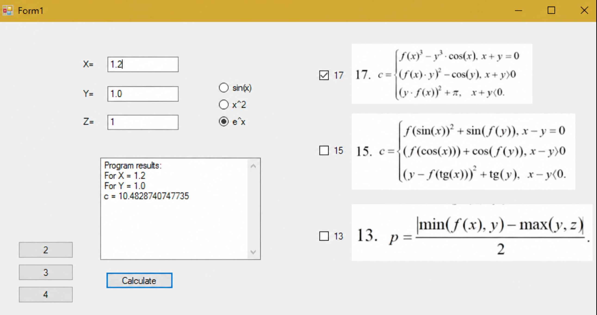
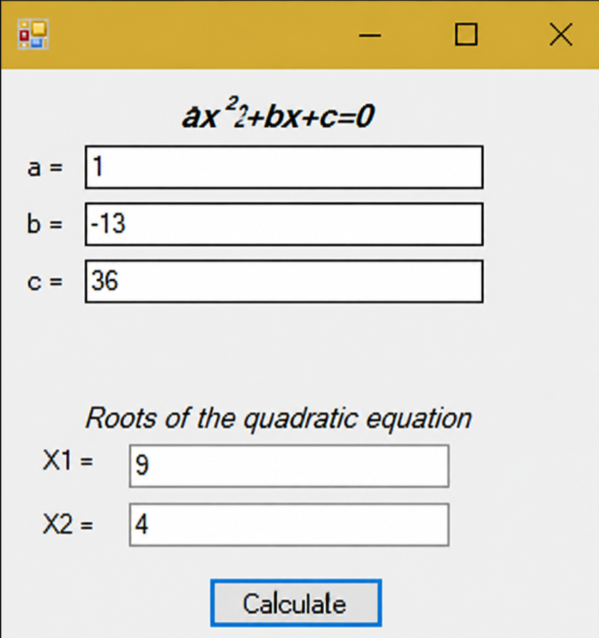

#  Lab6: C# WinForms GUI & Linear/Branching Algorithms

This laboratory assignment includes 3 C# WinForms applications demonstrating event-driven UI, state management, and math algorithm implementation:

```text
lab6/
├── 📂 access/             # Screenshots (2.jpg – 6.jpg)
├── 📄 Form1.cs            # Piecewise math calculator logic
├── 📄 Form2.cs            # Quadratic equation solver logic
└── 📄 Form3.cs            # Currency exchange simulator logic
```

1. **Math Expression Evaluator (`Form1.cs`)** — Computes piecewise mathematical equations with dynamic base function selection
<p align="center"> $f(x) \in \{\sin(x), x^2, e^x\}$.</p>
2. **Quadratic Equation Solver (`Form2.cs`)** — Solves $ax^2 + bx + c = 0$ and handles real roots via discriminant calculation.

3. **Currency Exchange Simulator (`Form3.cs`)** — Interactive currency converter with dynamic UI focus highlighting and direction indicators.

---

## 🖼️ Application Modules

### 1️⃣ Piecewise Function Evaluator (`Form1.cs`)
Evaluates target formulas (#17, #15, or #13) based on input variables ($X, Y, Z$) and active function logic:

<p align="center">
  
</p>

* **Function Chooser:** Toggle $f(x)$ dynamically between $\sin(x)$, $x^2$, and $e^x$ using radio buttons.
* **Equation Selection:** Switch between piecewise branches using controls.

---

### 2️⃣ Quadratic Equation Solver (`Form2.cs`)
Calculates the roots of $ax^2 + bx + c = 0$:

<p align="center">
  
</p>

* **Logic:** Evaluates Discriminant ($D = b^2 - 4ac$).
* **Root Output:** Displays $X_1$ and $X_2$ for $D > 0$, single root for $D = 0$, or an alert notification if $D < 0$.

---

### 3️⃣ Currency Exchange Simulator (`Form3.cs`)
Simulates exchange booth operations between USD and UAH:

<p align="center">
  
</p>

* **Interactive UI:** Highlights the active rate box in gold and changes directional arrow indicators (`<` / `>`) based on exchange direction (Buy/Sell).
* **Automated Calculation:** Multiplies selected currency rate by target amount.

---

> ℹ️ **Note:** The original Form Designer file (`.Designer.cs`) was lost. To ensure the code runs seamlessly, step-by-step setup instructions and UI component naming requirements have been embedded directly into the `.cs` source code.
> 
# 🎨 C# WinForms Graphics & Simulation Labs
C# WinForms lab project covering 2D graphics and animation. Includes geometric primitives drawing, star shape generation, and a real-time solar system simulation with planetary orbit trajectories.
## 📌 Overview

A collection of 3 C# Windows Forms projects demonstrating GDI+ rendering, custom shape plotting, and orbit physics:

📂 Repository Structure

```text
.
├── 📂 AutoMorphological/        # AutoMorphological processing lab
├── 📂 access/                   # Screenshots for main README
├── 📂 lab22/                    # Lab 22 C# WinForms project
├── 📂 lab6/                     # Lab 6 C# WinForms project
├── 📄 WindowsFormsApp4.cs       # Graphic Primitives
├── 📄 WindowsFormsApp5.cs       # Star Shape Generator
└── 📄 WindowsFormsApplication9.cs # Solar System Simulation
```
---

## 🖼️ Screenshots

#### 📐 Geometric Primitives (`WindowsFormsApp4.cs`)

Allows drawing filled or outlined shapes (squares, circles, ellipses) with custom dimensions.

<p align="center">
  
</p>

* **Flexible Input:** Enter width and height parameters. If only a single value is entered (e.g., `130`), it is automatically used as the uniform dimension for squares and circles.

<table align="center">
  <tr>
    <td></td>
    <td></td>
  </tr>
</table>

<p align="center">
  
</p>

<table align="center">
  <tr>
    <td></td>
    <td></td>
    <td></td>
    <td></td>
  </tr>
</table>

---

#### 🪐 Solar System Simulation (`WindowsFormsApplication9.cs`)

An interactive animation demonstrating planetary motion and orbital trajectories.

<p align="center">
  
  <br>
  <sub><i>Yellow arrows indicate the direction of orbital movement.</i></sub>
</p>

---

#### ⭐ Star Shape Generator (`WindowsFormsApp5.cs`)

Generates customizable multi-pointed star shapes using polar coordinate math.

<p align="center">
  
</p>

* **Parameters:**
  * **Center ($X, Y$):** Sets the position on the canvas.
  * **Inner & Outer Radii:** Controls point depth and length.
  * **Vertex Count:** Configures the number of star points.
  * **Color Picker:** Allows selecting a custom outline color.

---

## 🛠️ Tech Stack & Setup

* **Tech:** C#, .NET Framework, WinForms (`System.Drawing` / GDI+)
* **IDE:** Visual Studio

### How to Run:
1. Open or import `.cs` files into a **C# Windows Forms** project in Visual Studio.
2. Ensure Form Designer controls (`button1`, `panel1`, `textBox1`) match the names referenced in the code.
